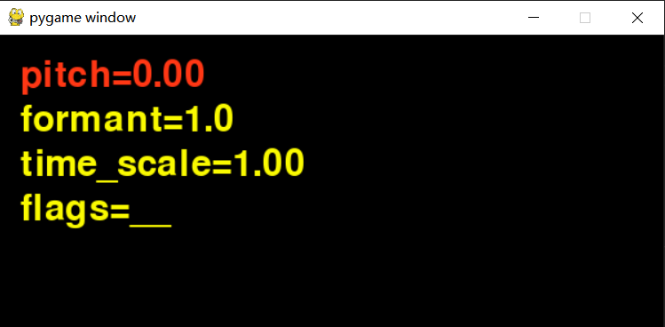

# A Simple python example of TD-PSOLA

based on [Sanna Wager's][1] implementation, plus some more ideas on [TD-PSOLA][2].

```bash
pip install -r requirements.txt
python ./td_psola2.py
# optionally you can pass your own wav file
python ./td_psola2.py myvoice.wav
```



Hover your mouse cursor above each item and scroll mouse wheel up/down to change corresponding configs in real time:

 - pitch
 - formant
 - time_scale

[1]: https://github.com/sannawag/TD-PSOLA
[2]: https://courses.engr.illinois.edu/ece420/sp2022/lab5/lab/

